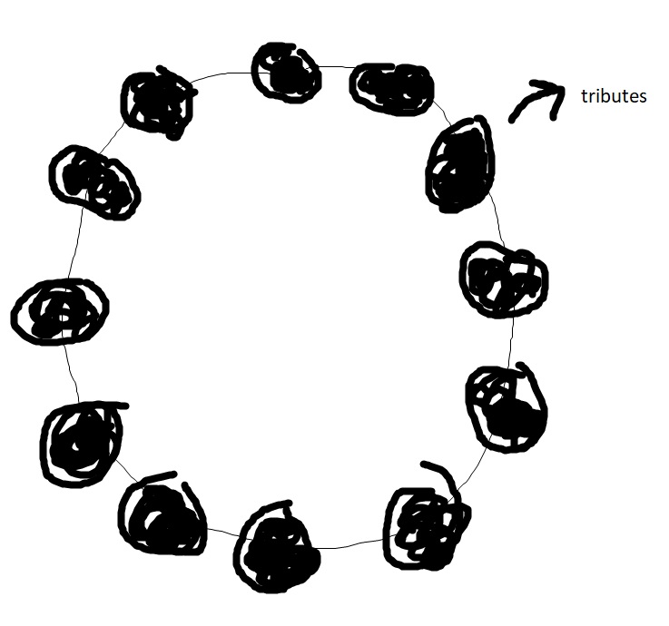
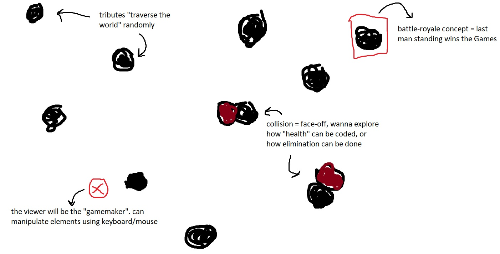
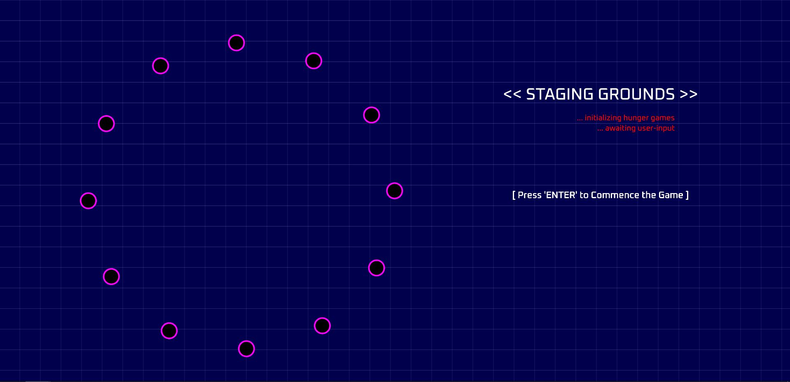

▶️▶️ **PART 1: PROJECT PROPOSAL** ◀️◀️

I've chosen to depict ***The Hunger Games***, a series of novels by Suzanne Collins via this project.

*The Hunger Games* universe is a dystopia set in Panem, a North American country consisting of the wealthy Capitol, and 13 districts in varying states of poverty. Every year, children from the first 12 districts are selected via lottery to participate in a mandatory & televised battle-royale death match called The Hunger Games.

<p align= "center">
 </p>

In the novel (and the movie adaptations), these "Games" are designed by someone called the "Gamemaker", a highly coveted title, and personally hand-picked by the President of Panem. My idea is something along the lines of this:

The user interacting with this project is the *Gamemaker*, and they'll be "tracking" everything via this interface or ***interactive*** dashboard. I'm thinking of coding a version of this game that would replicate the original's feel, and also bring forth the battle-royale aspect of it.

The "tributes" would start off in a circle (as they do in the books), and wander about the canvas in a random fashion. I'm thinking of implementing a time-based traversing method, something like, the positions of these tributes (represented by ellipses) would get updated each passing second, mimicking a radar/sonar map.

<p align= "center">

<br>
Figure 1.1: "Tributes" starting-off position </p>
<br>
<p align= "center">

<br>
Figure 1.2: Rough Digital Sketch of Project Implementation </p>

In addition to these, I'm thinking of exploring some "collision mechanics" i.e. how to code the ellipses' health or elimination tactics. Similarly, as Gamemaker, the user would be able to manipulate the Game using the mouse and/or keyboard, and would be able to alter the "gameplay", such as: eliminating tributes, or introducing obstacles (??). Ultimately, only one ellipse or tribute would remain on-screen, and shall be the "Victor" of the Game.

Right now, I think detecting collisions, and reducing "hitpoints" of ellipses accordingly would be quite challenging, but I'll try to figure out some method for that.

▶️▶️ **PART 2: PROJECT PSEUDO-CODE** ◀️◀️

This week, I've prepared the "staging ground" of the project i.e. the part where all the *tributes* are arranged in a circular fashion, just before the Game's commencement (refer Figure 1.1). The *Gamemaker* (user) then interacts using the keyboard to start the Game.

<p align= "center">

<br>
Figure 2.1: Live Screenshot of Staging Ground </p>

This part in itself was quite challenging and time-consuming because of the circular arrangement. After countless tries with *translate()* and *rotate()*, I ultimately decided to configure the canvas into WEBGL mode. This made p5 set its (0,0) coordinate to the center of the screen.

Furthermore, I've begun coding the active Game interface, and have generated the *tributes* in a random fashion, with their positions changing with each passing second. The position-change code requires further refinement at the moment. The ***active_game.js*** file includes the working code, along with all the various pseudo-code for all the upcoming features. These include:

**1. Class variables for storing tributes' hitpoints, hit values & unique district IDs**
```
this.district_id = [1-12]; --> will be given during instantiation: constructor(i);
this.hitpoints = 100;
this.hit_value = int(random(20,50));
```

**2. Class functions for detecting collisions & modifying hitpoints of tributes**
```
collision_detection()
{
  if(collision with self)
  {
    ignore;
  }
  else
  {
    for(all other tributes)
    {
      detect collision and reduce hitpoints accordingly;
    }
  }
}
hitpoints()
{
  if(collision)
  {
    hitpoints = hitpoints-(otherTribute.hit_value);
  }
}
```
**3. Separate functions for detecting "tribute eliminations" and "lone tribute"**
```
function tributesAlive()
{
  let tributeCounter = totalTributes;
  if(tributeObject.hitpoints==0)
  {
    tributeCounter--;
  }
}

function victorChecker()
{
  if(tributeCounter==1)
  {
    display tribute details;
  }
}
```
**4. Inclusion of cosmetic changes to the overall game aesthetic**
```
background-color: green -- BEAUTIFICATION
for(entire canvas)
{
  generate lines to mimic radar / gps;
}
```